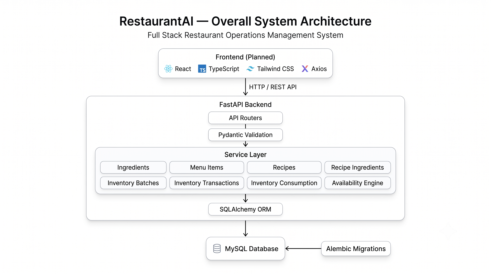
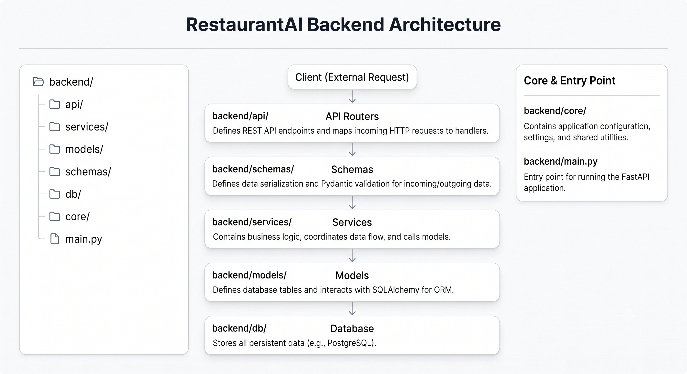
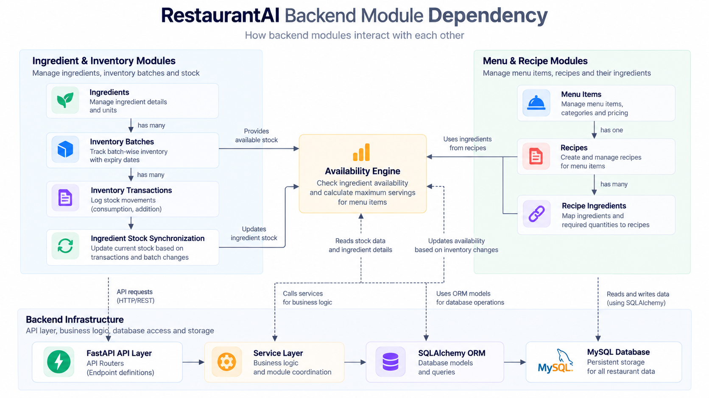
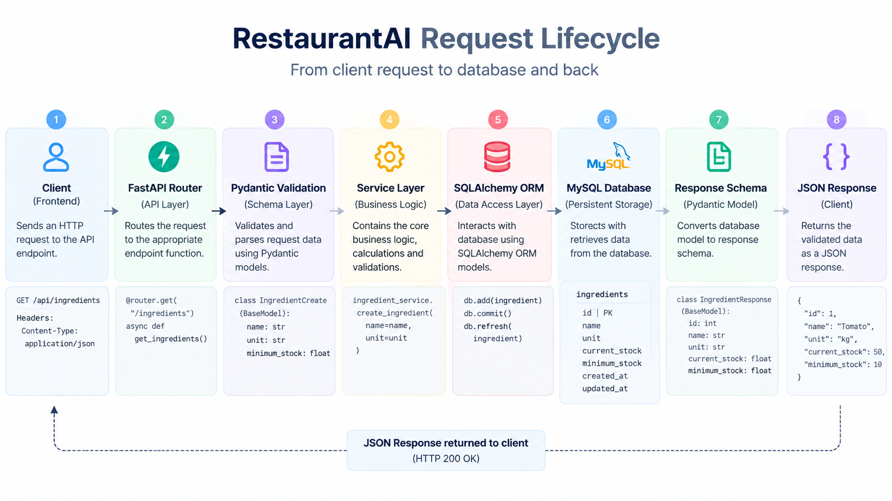
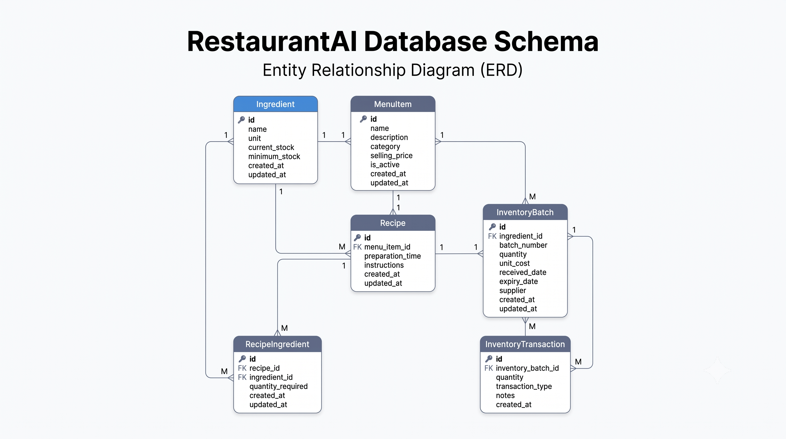
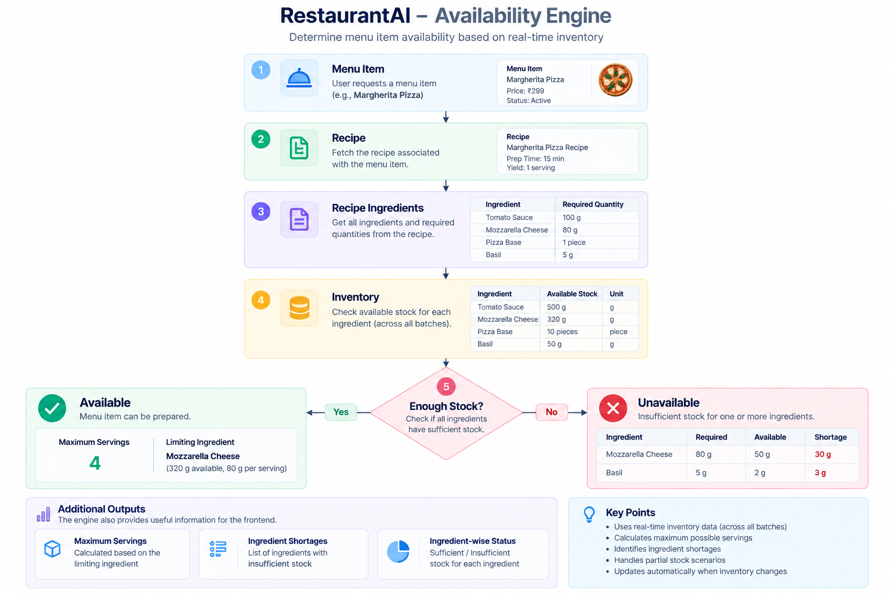

# System Architecture

## 1. Architectural Philosophy

RestaurantAI is engineered as a **production-inspired, layered backend system** designed to solve complex restaurant operations: ingredient inventory lot tracking, immutable stock movement auditing, recipe formulation, and real-time dish availability calculation.

The architecture prioritizes:
- **Separation of Concerns:** Each layer has a single, well-defined responsibility.
- **Data Integrity:** Strict validation at both runtime (Pydantic) and database levels (foreign key constraints, unique indexes, check constraints, transactions).
- **Auditability:** Core operational events (stock consumption, waste, adjustments) are recorded as immutable transaction logs.
- **Maintainability:** Code is written to be clean, explicit, and easy to explain during technical interviews.

---

## 2. High-Level Architecture Overview

The system follows a classic **Three-Tier Layered Architecture** with unidirectional data flow:



```
[ Client / React Frontend / Swagger UI ]
                   │
                   ▼ (HTTP / JSON REST)
       ┌───────────────────────┐
       │      API Routers      │  <-- Routing, HTTP Serialization, Status Codes
       └───────────┬───────────┘
                   │
                   ▼ (Validated Pydantic Schemas)
       ┌───────────────────────┐
       │     Service Layer     │  <-- Business Logic, Transactions, Validations
       └───────────┬───────────┘
                   │
                   ▼ (SQLAlchemy 2.0 ORM Queries)
       ┌───────────────────────┐
       │   Data Access Layer   │  <-- SQLAlchemy Models & Connection Pool
       └───────────┬───────────┘
                   │
                   ▼ (SQL Queries / DDL Migrations)
       ┌───────────────────────┐
       │     MySQL 8.0 DB      │  <-- Relational Storage & Integrity Constraints
       └───────────────────────┘
```

---

## 3. Layered Architecture Components



```
backend/app/
├── api/          # Presentation Layer (FastAPI Routers)
├── services/     # Domain & Business Logic Layer
├── schemas/      # Data Transfer & Validation Layer (Pydantic v2)
├── models/       # Data Access Layer (SQLAlchemy 2.0 ORM Entities)
├── db/           # Database Engine & Session Lifecycle Management
└── core/         # Cross-Cutting Concerns (Config, Domain Enums)
```

### Presentation Layer (`api/`)
- **Role:** Handles incoming HTTP requests, route matching, path/query parameter parsing, and response status codes.
- **Principle:** Thin controllers. Routers perform **no database queries** and **no business calculations**. They extract input, delegate directly to the service layer, and return typed Pydantic responses.
- **Dependency Injection:** Injects database sessions per request using FastAPI's `Depends(get_db)`.

### Service Layer (`services/`)
- **Role:** The brain of the application. Encapsulates all domain logic, cross-entity rules, inventory calculations, and transactional boundaries.
- **Responsibilities:**
  - Case-insensitive uniqueness enforcement (e.g. `func.lower()`).
  - Pre-validation of business conditions before database writes.
  - Multi-table transaction orchestration with automatic rollback on errors.
  - Stock level recalculations and derived synchronization.

### Schema Layer (`schemas/`)
- **Role:** Data Transfer Objects (DTOs) powered by Pydantic v2.
- **Separation:**
  - `*Create`: Input payloads with strict validation rules.
  - `*Update`: Partial update schemas where all fields are optional.
  - `*Response`: Output payloads with `from_attributes = True` for automatic ORM model serialization.
- **Normalization:** Automatically trims whitespace, capitalizes strings, and enforces numerical boundaries (`gt=0`, decimal places).

### Persistence Layer (`models/`)
- **Role:** SQLAlchemy 2.0 declarative models mapping to relational tables.
- **Design:** Explicit data typing (`Mapped[...]`), foreign key relationships with cascading rules, database indexes, and database-level check constraints.

### Database & Core Infrastructure (`db/`, `core/`)
- **`core/config.py`:** Type-safe settings loaded from `.env` using `pydantic-settings`.
- **`core/enums.py`:** Centralized domain enums (`Unit`, `MenuCategory`, `TransactionType`) decoupled from ORM models to avoid circular dependencies.
- **`db/database.py`:** SQLAlchemy engine configuration, connection pooling (`pool_pre_ping=True`), `SessionLocal` factory, and request-scoped session generator.

### Backend Module Dependency Graph



Dependencies between backend modules remain strictly layered and acyclic:
- Root entity models (`Ingredient`, `MenuItem`) have no dependencies on higher-level operations.
- Intermediary models (`Recipe`, `RecipeIngredient`, `InventoryBatch`, `InventoryTransaction`) link root entities with relational integrity rules.
- Operational services (`InventoryConsumptionService`, `AvailabilityService`) orchestrate lower-level repositories and entities to fulfill complex kitchen workflows.

---

## 4. End-to-End Request Lifecycle

When a client makes a request to the backend, it passes through a deterministic 6-step lifecycle:



```
[1. HTTP Request]
       │
       ▼
[2. FastAPI Router] ──(Validates URL, Route, Query/Path Params)
       │
       ▼
[3. Pydantic Parsing] ──(Fails? Return 422 Unprocessable Entity)
       │ (Success)
       ▼
[4. Service Layer] ──(Validates Business Rules, Checks Existence)
       │               (Fails? Raise HTTPException 400 / 404 / 409)
       ▼
[5. Database Transaction] ──(Executes Queries via SQLAlchemy Session)
       │                      (Fails? Rollback & Raise Error)
       ▼
[6. Pydantic Serialization] ──(Maps ORM Instance -> JSON Response -> 200/201 OK)
```

1. **Routing:** FastAPI matches the HTTP method and path to the appropriate router function.
2. **Dependency Resolution:** FastAPI calls `get_db()`, providing an isolated `SessionLocal` for this request.
3. **Schema Validation:** The request body is parsed into the target Pydantic schema. If any field violates constraints (e.g. negative quantity or invalid enum), a detailed `422 Unprocessable Entity` response is returned immediately before touching the database.
4. **Service Execution:** The router delegates to the domain service. The service executes domain logic (e.g. verifying ingredient references, checking batch stock).
5. **Database Transaction:** The service stages changes on the SQLAlchemy session, commits the transaction, and refreshes the entity. If any database exception occurs, `session.rollback()` is executed to preserve consistency.
6. **Response Serialization:** The resulting ORM instance is serialized through the response schema and returned with the appropriate HTTP status code (e.g. `200 OK` or `201 Created`). The `get_db()` generator closes the database session in its `finally` block.

---

## 5. Core Domain Architectures



### 1. Separation of Commercial Catalog and Culinary Formulas

In restaurant operations, what a customer buys is fundamentally different from how the kitchen prepares it:
- **`MenuItem`:** The commercial product in the catalog (e.g., "Cheeseburger", $9.99). It has a selling price and category, but **no stock** and **no ingredient lists**.
- **`Recipe`:** The culinary formula. Linked 1-to-1 with a `MenuItem`.
- **`RecipeIngredient`:** The bill of materials. Explicit many-to-many join table linking a `Recipe` with an `Ingredient` along with the exact required quantity per serving.

```
┌──────────────┐         1:1          ┌──────────┐
│   MenuItem   │ ───────────────────> │  Recipe  │
└──────────────┘                      └────┬─────┘
                                           │ 1:N
                                           ▼
┌──────────────┐         1:N          ┌──────────────────┐
│  Ingredient  │ <─────────────────── │ RecipeIngredient │
└──────────────┘                      └──────────────────┘
```

**Why this matters:**
- Retail items (like canned sodas) can exist in the catalog without needing a kitchen recipe.
- Recipe specifications can be adjusted or versioned without changing customer-facing menu item identifiers.

---

### 2. Inventory Lot Tracking & Audit Architecture

Restaurant inventory cannot be tracked simply as a single scalar number. Fresh ingredients arrive on different dates, at different unit costs, from different vendors, and with different expiration dates.

```
┌────────────────────────────────────────────────────────┐
│                       Ingredient                       │
│  (Master record: name, unit, minimum reorder stock)    │
│  current_stock: DERIVED SUM(InventoryBatch.quantity)   │
└───────────────────────────┬────────────────────────────┘
                             │ 1:N
                             ▼
┌────────────────────────────────────────────────────────┐
│                     InventoryBatch                     │
│  (The Physical Source of Truth)                        │
│  - batch_number: <CODE>-<YYYYMMDD>-<SEQ>               │
│  - quantity: Available stock remaining                 │
│  - received_date / expiry_date                         │
└───────────────────────────┬────────────────────────────┘
                             │ 1:N
                             ▼
┌────────────────────────────────────────────────────────┐
│                  InventoryTransaction                  │
│  (Immutable Audit Log)                                 │
│  - type: CONSUMPTION | WASTE | ADJUSTMENT | EXPIRED    │
│  - quantity: Deducted amount (> 0)                     │
│  - created_at: Immutable timestamp                     │
└────────────────────────────────────────────────────────┘
```

1. **Batch Source of Truth:** `InventoryBatch` records represent real physical shipments. Intake records are immutable once received.
2. **Deterministic Batch Numbering:** System-generated codes in the format `<CODE>-<YYYYMMDD>-<SEQUENCE>` (e.g., `BEE-20260924-001`).
3. **Synchronized Ingredient Stock:** `Ingredient.current_stock` is not manually edited. It is a **derived snapshot** equal to the database sum:
   $$\text{Ingredient.current\_stock} = \sum \text{InventoryBatch.quantity}$$
   Whenever batches are created, modified, deleted, or consumed, `sync_ingredient_stock()` updates this balance using optimized SQL `COALESCE(SUM())` aggregation.
4. **Immutable Movement Auditing:** All stock deductions require creating an `InventoryTransaction`. Transactions can never be updated or deleted via the API, creating a permanent audit trail for shrinkage, spoilage, and sales analysis.

---

### 3. Automated FEFO / FIFO Inventory Consumption Engine

When dishes are prepared, kitchen staff should use older or closer-to-expiry stock first. The backend automates this through `POST /inventory/consume`:

```
Client calls: POST /inventory/consume (recipe_id=1, servings=5)
                          │
                          ▼
        ┌────────────────────────────────────┐
        │       Two-Phase Validation         │
        │  Check all ingredients & batches   │
        │  upfront. Is total stock enough?   │
        └─────────────────┬──────────────────┘
                          │
            ┌─────────────┴─────────────┐
            ▼ (No)                      ▼ (Yes)
  [ Abort with 400 Bad Request ]  ┌────────────────────────────────────┐
  [ Zero database changes made ]  │       FEFO Deduction Loop          │
                                  │  Order batches by:                 │
                                  │  1. expiry_date ASC (FEFO)         │
                                  │  2. received_date ASC (FIFO)       │
                                  │  3. batch_number ASC               │
                                  └─────────────────┬──────────────────┘
                                                    │
                                                    ▼
                                  ┌────────────────────────────────────┐
                                  │  Atomic Commit & Stock Sync        │
                                  │  - Update batch quantities         │
                                  │  - Write CONSUMPTION audit records │
                                  │  - Resync Ingredient.current_stock │
                                  └────────────────────────────────────┘
```

- **FEFO (First-Expiring, First-Out):** Batches with the earliest expiration date are depleted first to minimize kitchen spoilage.
- **FIFO Tie-Breaker:** When expiration dates match, the oldest intake batch is used.
- **Multi-Batch Spanning:** If batch A only has 2 kg available and 5 kg is needed, batch A is reduced to 0.00 and the remaining 3 kg is drawn from batch B.
- **Two-Phase Atomic Execution:** The engine inspects every recipe ingredient upfront. If even one ingredient lacks sufficient stock across all batches, the transaction aborts with `400 Bad Request` and zero partial deductions are saved.

---

### 4. Real-Time Dish Availability Engine

The Availability Engine answers: *"How many servings of this dish can the kitchen prepare right now?"*



$$\text{Servings Available} = \min_{i \in \text{Ingredients}} \left\lfloor \frac{\text{Ingredient.current\_stock}_i}{\text{RecipeIngredient.quantity}_i} \right\rfloor$$

- **Read-Only Guarantee:** Availability calculations do not acquire write locks or create transaction records.
- **Bottleneck Detection:** The engine identifies precisely which ingredient is the limiting constraint and calculates the exact shortage quantity.
- **N+1 Query Optimization:** Instead of firing individual queries inside loops, bulk endpoints (`/availability/recipes` and `/availability/menu-items`) execute batch queries using SQL `IN` operators and eager loading (`joinedload(RecipeIngredient.ingredient)`), reducing hundreds of database round-trips to just 2 or 3 queries.

---

## 6. Database Migration Strategy (Alembic)

Database schema evolution is strictly decoupled from runtime application code:
- Models inherit from `DeclarativeBase`.
- Alembic's `env.py` binds to the shared database engine and imports `Base.metadata`.
- All schema alterations are version-controlled Python migration scripts committed directly to Git in `backend/alembic/versions/`.
- Migrations support both online execution (direct MySQL connection) and offline generation (`--sql`) for review before production deployment.

---

## 7. Error Handling Philosophy

The API follows standard REST HTTP semantics:

| HTTP Status | Meaning | Typical Usage in RestaurantAI |
|---|---|---|
| `200 OK` | Success | Successful retrieval, update, or deletion. |
| `201 Created` | Resource Created | Successful creation of an ingredient, recipe, batch, or transaction. |
| `400 Bad Request` | Domain Rule Violation | Insufficient inventory stock, recipe without ingredients, invalid date sequence. |
| `404 Not Found` | Entity Missing | Referenced ID does not exist in the database. |
| `409 Conflict` | Unique Violation | Duplicate name (case-insensitive) or attempting to assign a second recipe to a menu item. |
| `422 Unprocessable Entity` | Schema Failure | Pydantic validation failure (e.g. negative quantity, invalid enum value). |
| `503 Service Unavailable` | Dependency Down | Database connectivity failure during health checks. |

---

## 8. Scalability & Future Extensibility

### 1. Frontend Integration (Phase 3)
The backend is completely stateless and ready for standard SPA consumption:
- CORS middleware can be configured in `main.py`.
- OpenAPI documentation (`/docs`) provides automatic schema synchronization for TypeScript interfaces.
- Standard JSON responses map cleanly to React state and Axios API clients.

### 2. Future AI & ML Integration
The existing database schema was intentionally designed to support future AI features:
- **Spoilage Prediction:** `InventoryTransaction` records with type `EXPIRED` and `WASTE` provide historical datasets for machine learning models to forecast waste patterns.
- **Dynamic Menu Suggestions:** The real-time availability engine provides the exact input required for an AI recommendation service to suggest daily specials utilizing ingredients closest to expiration.
- **Predictive Reordering:** Historical consumption transaction frequency enables automated lead-time reordering models.

### 3. Production Deployment Considerations
- **ASGI Concurrency:** Deployable with Uvicorn workers behind a reverse proxy (e.g. Nginx or Traefik).
- **Containerization:** Clean separation of configuration via environment variables enables simple multi-stage Docker builds.
- **Managed Database:** Connection pooling with `pool_pre_ping=True` is pre-configured to work reliably with managed cloud MySQL instances (AWS RDS, Google Cloud SQL).
