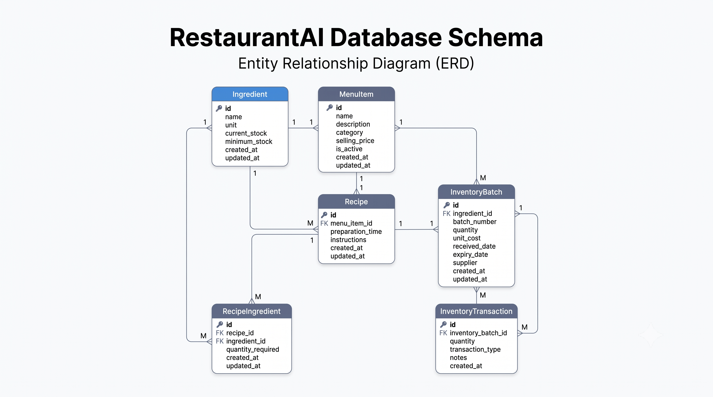
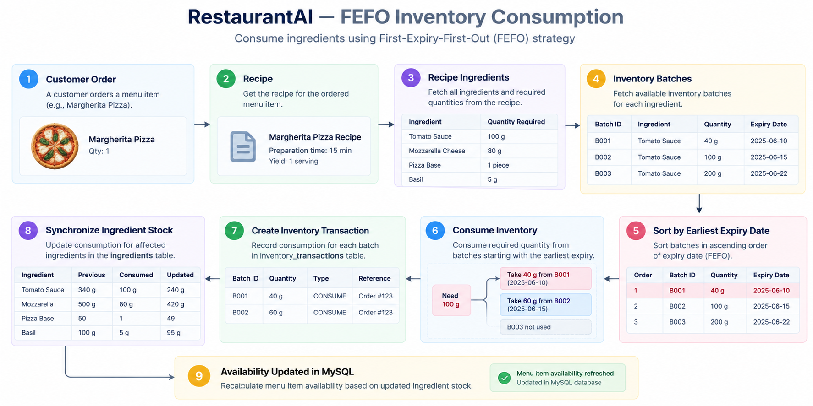
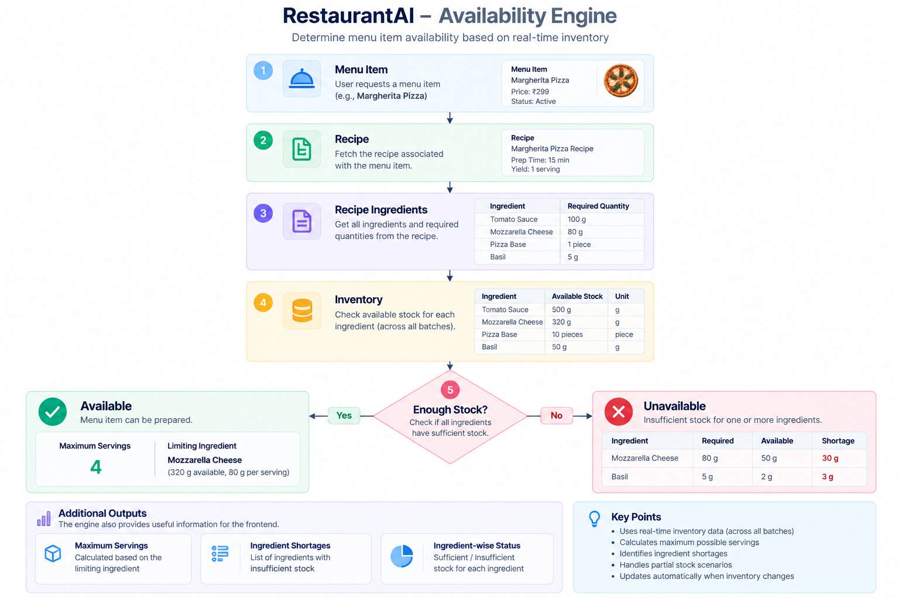

# Engineering Decisions & Design Rationale

This document outlines the core technical and architectural decisions made while engineering the **RestaurantAI** backend. Each entry explains the business or technical problem, the decision made, alternatives evaluated, trade-offs, and practical interview takeaways.

---

## Table of Decisions

1. [Decision 01: Adopt FastAPI as the Backend Web Framework](#decision-01-adopt-fastapi-as-the-backend-web-framework)
2. [Decision 02: Use SQLAlchemy 2.0 as the Object-Relational Mapper (ORM)](#decision-02-use-sqlalchemy-20-as-the-object-relational-mapper-orm)
3. [Decision 03: Adopt MySQL as the Primary Relational Database](#decision-03-adopt-mysql-as-the-primary-relational-database)
4. [Decision 04: Use Alembic for Database Migrations](#decision-04-use-alembic-for-database-migrations)
5. [Decision 05: Data Validation & Settings Management via Pydantic v2](#decision-05-data-validation--settings-management-via-pydantic-v2)
6. [Decision 06: Choose REST Architecture over GraphQL](#decision-06-choose-rest-architecture-over-graphql)
7. [Decision 07: Adopt a Three-Tier Layered Architecture](#decision-07-adopt-a-three-tier-layered-architecture)
8. [Decision 08: Backend-First Domain Delivery Strategy](#decision-08-backend-first-domain-delivery-strategy)
9. [Decision 09: First-Expiring, First-Out (FEFO) Inventory Consumption Strategy](#decision-09-first-expiring-first-out-fefo-inventory-consumption-strategy)
10. [Decision 10: Immutable Inventory Transactions for Movement Auditing](#decision-10-immutable-inventory-transactions-for-movement-auditing)
11. [Decision 11: Two-Layer Validation Strategy (Pydantic vs Service Layer)](#decision-11-two-layer-validation-strategy-pydantic-vs-service-layer)
12. [Decision 12: Batches as Single Source of Truth with Synchronized Ingredient Stock](#decision-12-batches-as-single-source-of-truth-with-synchronized-ingredient-stock)
13. [Decision 13: Separation of Menu Items (Commercial) from Recipes (Culinary)](#decision-13-separation-of-menu-items-commercial-from-recipes-culinary)
14. [Decision 14: Use Fixed-Point Decimal Arithmetic for Financials and Quantities](#decision-14-use-fixed-point-decimal-arithmetic-for-financials-and-quantities)
15. [Decision 15: Adopt React 19, TypeScript, and Vite for the Single-Page Application (SPA)](#decision-15-adopt-react-19-typescript-and-vite-for-the-single-page-application-spa)
16. [Decision 16: Centralized HTTP Client Layer via Axios and Server State Caching via TanStack React Query](#decision-16-centralized-http-client-layer-via-axios-and-server-state-caching-via-tanstack-react-query)
17. [Decision 17: Utility-First Styling with Tailwind CSS and a Persistent SaaS Dashboard Shell](#decision-17-utility-first-styling-with-tailwind-css-and-a-persistent-saas-dashboard-shell)

---

## Decision 01: Adopt FastAPI as the Backend Web Framework

### Problem
A restaurant management system requires high-performance REST APIs to handle frequent inventory lookups, live availability checks, and complex transactional deductions. The framework needed to support automatic data validation, interactive documentation, clean typing, and fast development turnaround.

### Decision
Use **FastAPI** running on the **Uvicorn** ASGI server.

### Why It Was Chosen
- **Automatic Schema Validation:** Integrates natively with Pydantic v2 to validate request payloads before they reach business logic.
- **Auto-Generated Documentation:** Generates interactive Swagger UI (`/docs`) and ReDoc (`/redoc`) automatically from code type hints.
- **Modern Python Typing:** Built from the ground up for Python 3.10+ type hints, enhancing code clarity and catching runtime bugs early.
- **Performance:** Built on Starlette and Pydantic, making it one of the fastest Python web frameworks available.

### Alternatives Considered
- **Flask:** Lightweight and simple, but lacks built-in request validation, schema serialization, and automatic API documentation. Adding these requires multiple third-party libraries (Marshmallow, Flasgger).
- **Django REST Framework (DRF):** Extremely feature-complete, but tightly coupled with the Django ORM and comes with heavy boilerplate (admin panel, templates, auth) that was unnecessary for this microservice-style REST API.

### Advantages
- Minimal boilerplate; clean dependency injection system (`Depends()`).
- Self-documenting endpoints reduce friction when integrating with a frontend team.
- Built-in asynchronous capabilities ready for future scaling.

### Limitations
- Requires discipline to keep routers thin and business logic in the service layer.

### Interview Key Takeaway
> *"I chose FastAPI because it provides type safety, automated validation via Pydantic, and self-documenting OpenAPI schemas out of the box, allowing me to build clean, maintainable REST endpoints with minimal boilerplate."*

---

## Decision 02: Use SQLAlchemy 2.0 as the Object-Relational Mapper (ORM)

### Problem
Raw SQL strings scattered across code files are error-prone, vulnerable to SQL injection, difficult to maintain, and lack type safety when models evolve.

### Decision
Adopt **SQLAlchemy 2.0** using its modern declarative mapping (`DeclarativeBase`, `Mapped`, `mapped_column`) and execution syntax (`select()`).

### Why It Was Chosen
- **Industry Standard:** The most robust, widely-used ORM in the Python ecosystem.
- **SQLAlchemy 2.0 Modernization:** Full static typing support with type-annotated attributes (`Mapped[int]`, `Mapped[str]`).
- **Connection Lifecycle Management:** Robust session handling and connection pooling (`pool_pre_ping=True`) that automatically recovers from dropped MySQL connections.
- **Query Optimization:** Explicit control over joins and eager loading (`joinedload`, `selectinload`) to eliminate N+1 query bottlenecks.

### Alternatives Considered
- **Raw SQL (PyMySQL directly):** Fast, but requires manual query building, object serialization, and increases SQL injection vulnerabilities.
- **Tortoise ORM:** Async-first, but has a smaller community and less mature migration ecosystem compared to SQLAlchemy + Alembic.

### Advantages
- Safe parameterized queries protect against SQL injection.
- Consistent Python-centric query syntax across the entire service layer.
- Clean request-scoped session lifecycles using FastAPI's `get_db` generator.

### Limitations
- Higher initial learning curve than active-record style ORMs.

### Interview Key Takeaway
> *"SQLAlchemy 2.0 provides enterprise-grade database session management, connection pooling, and explicit query control. Using its modern 2.x declarative syntax gave us complete type safety across all database interactions."*

---

## Decision 03: Adopt MySQL as the Primary Relational Database

### Problem
Restaurant operations require strong ACID guarantees: inventory deductions, transaction logging, and recipe assignments must be consistent. A corrupt or eventually-consistent inventory state can cause the kitchen to accept orders it cannot fulfill.

### Decision
Use **MySQL 8.0** as the primary relational database storage engine.

### Why It Was Chosen
- **Relational Integrity:** Strong foreign key constraints, cascading deletes, and unique composite indexes protect against orphaned records.
- **ACID Transactions:** Full support for multi-statement atomic transactions (`COMMIT` / `ROLLBACK`).
- **Production Alignment:** MySQL is one of the most widely deployed relational database engines in commercial software engineering.

### Alternatives Considered
- **MongoDB:** Schemaless document storage would permit rapid prototyping, but lacks the native relational constraints needed to enforce strict recipe-ingredient and batch-transaction relationships.
- **PostgreSQL:** An excellent alternative with richer custom types, but MySQL was chosen due to widespread enterprise presence and straightforward hosting availability.

### Advantages
- Enforces data integrity at the storage layer via Foreign Keys, Unique Indexes, and Check Constraints.
- Reliable row-level locking for concurrent stock movements.

### Limitations
- Schema changes require careful migration planning in production.

---

## Decision 04: Use Alembic for Database Migrations

### Problem
Using `Base.metadata.create_all()` works only on empty databases; it cannot alter existing tables, add indexes, or update columns without dropping tables and destroying data.

### Decision
Adopt **Alembic** as the schema migration tool.

### Why It Was Chosen
- **Native SQLAlchemy Integration:** Reads models inheriting from `DeclarativeBase` directly.
- **Autogeneration:** Generates migration scripts by comparing Python model definitions with live database schemas (`alembic revision --autogenerate`).
- **Versioned History:** All migrations are committed to Git as reversible Python scripts (`upgrade()` and `downgrade()`).

### Alternatives Considered
- **Manual SQL Migration Scripts:** Prone to human error, lack version tracking, and easily cause schema drift across environments.
- **Flyway:** Language-agnostic, but lacks direct Python/SQLAlchemy model introspection.

### Advantages
- Reproducible database schema across development, testing, and production.
- Prevents data loss during schema evolution.

---

## Decision 05: Data Validation & Settings Management via Pydantic v2

### Problem
Incoming request data from HTTP clients cannot be trusted. Type conversion, field boundary validation, and string normalization are tedious and error-prone when written manually.

### Decision
Use **Pydantic v2** for DTO request/response schemas and **`pydantic-settings`** for application configuration.

### Why It Was Chosen
- **Performance:** Pydantic v2 is implemented in Rust, providing near-instant validation.
- **Automatic Coercion & Normalization:** Strips whitespace, standardizes casing (e.g. `.title()`), and validates numeric bounds (`gt=0`).
- **Fail-Fast Configuration:** `pydantic-settings` validates environment variables on application startup. If a required database credential or port is missing or malformed, the server fails immediately rather than failing mid-request.

### Advantages
- Clean separation between incoming wire data and internal database models.
- Centralized error response format (`422 Unprocessable Entity`) returned automatically by FastAPI.

---

## Decision 06: Choose REST Architecture over GraphQL

### Problem
Deciding the client-server communication protocol for the restaurant management system.

### Decision
Implement standard **RESTful APIs** using HTTP methods (`GET`, `POST`, `PUT`, `DELETE`) and standard HTTP status codes.

### Why It Was Chosen
- **Predictable Resource Modeling:** Restaurant operations map naturally to standard resources: `/ingredients`, `/recipes`, `/inventory-batches`, `/menu-items`.
- **HTTP Caching & Simplicity:** Standard HTTP status codes (`200`, `201`, `400`, `404`, `409`, `422`) make client-side error handling straightforward.
- **Fresher & Interview Friendly:** Easier to build, test, and explain without introducing the query complexity, caching hurdles, and payload overhead of GraphQL.

### Alternatives Considered
- **GraphQL:** Great for complex frontend data aggregation, but adds significant backend query complexity (N+1 query resolution, query depth limiting, over-fetching protections) that offered little value for a resource-oriented CRUD and operations API.

---

## Decision 07: Adopt a Three-Tier Layered Architecture

### Problem
Monolithic backend code where SQL queries, validation, HTTP response parsing, and business logic are mixed together in a single file becomes unmaintainable, difficult to test, and messy as the project expands.

### Decision
Enforce a strict **Three-Tier Architecture**:
1. **Routers (`api/`):** Request routing, response serialization, HTTP status codes.
2. **Services (`services/`):** Business logic, validation, transactional coordination.
3. **Data Access (`models/` + `db/`):** SQLAlchemy ORM models, migrations, and database sessions.

### Why It Was Chosen
- **Single Responsibility Principle (SRP):** Routers do not know how queries are constructed; models do not know about HTTP requests.
- **Testability:** Service classes can be tested in isolation using mock database sessions without spinning up HTTP servers.
- **Maintainability:** New developers can navigate the codebase intuitively.

### Advantages
- Reusable business logic across different endpoints.
- Isolated bug fixing: a routing change never breaks domain logic, and a database change never breaks HTTP contracts.

---

## Decision 08: Backend-First Domain Delivery Strategy

### Problem
Attempting to build a full-stack project by creating frontend pages and backend endpoints simultaneously often results in shifting API contracts, unfinished pages, and broken features.

### Decision
Deliver the backend core sequentially, domain-by-domain:
1. Foundation & Health -> 2. Ingredients -> 3. Menu Items -> 4. Recipes -> 5. Recipe Ingredients -> 6. Inventory & Transactions -> 7. Availability Engine -> 8. Backend Refactoring -> 9. React Frontend.

### Why It Was Chosen
- **Solid Foundation:** Ensures every backend entity, foreign key, and business calculation is fully verified and stable before any UI is built.
- **Clear Milestone Tracking:** Eliminates ambiguity during development.
- **Contract Stability:** The React frontend can integrate against fixed, well-tested Swagger endpoints without the backend moving under its feet.

---

## Decision 09: First-Expiring, First-Out (FEFO) Inventory Consumption Strategy

### Problem
Perishable restaurant ingredients (produce, dairy, meats) will spoil if older shipments are ignored in favor of newer deliveries. A generic FIFO (First-In, First-Out) strategy does not account for vendors delivering products with differing expiration dates.

### Decision
Implement an automated **FEFO (First-Expiring, First-Out)** consumption algorithm with **FIFO tie-breaking**:
1. Order eligible batches by `expiry_date ASC` (FEFO).
2. For batches with identical expiry dates, order by `received_date ASC` (FIFO).
3. Deterministically tie-break remaining matches by `batch_number ASC`.

### Why It Was Chosen
- **Minimizes Food Waste:** Automatically draws from lots closest to expiration first.
- **Multi-Batch Spanning:** Transparently depletes an expiring batch and draws the remainder from the next available lot.
- **Atomic Two-Phase Execution:** Validates that total available stock across all batches is sufficient for all ingredients before executing any deductions, guaranteeing zero partial writes on failure.

### Interview Key Takeaway
> *"In a restaurant, FIFO isn't always enough because a newer shipment might have a shorter shelf-life than an older one. FEFO guarantees that ingredients closest to spoiling are consumed first, directly minimizing food waste."*

---

## Decision 10: Immutable Inventory Transactions for Movement Auditing

### Problem
Allowing direct, unrecorded edits to inventory quantities makes it impossible to investigate shrinkage, kitchen waste, or stock discrepancies.

### Decision
Treat `InventoryTransaction` records as **strictly immutable audit logs**.

### Why It Was Chosen
- **Financial & Operational Auditing:** Every stock deduction records who, what, when, why, and how much (`CONSUMPTION`, `WASTE`, `ADJUSTMENT`, `EXPIRED`).
- **No Update or Delete Endpoints:** Transaction records can only be created. They cannot be edited or deleted through the API.
- **Database-Level Constraint:** Quantity must always be strictly positive (`quantity > 0`).

---

## Decision 11: Two-Layer Validation Strategy (Pydantic vs Service Layer)

### Problem
Where should validation live? Putting all validation in routers creates bloated controllers; putting basic type validation in database models leads to unhelpful database error tracebacks.

### Decision
Establish a clear **Two-Layer Validation Strategy**:
1. **Schema Validation (Pydantic):** Syntactic & field-level validation (data types, positive numbers, non-empty strings, regex patterns, date sequence). Fails fast with HTTP 422.
2. **Service Validation (Service Layer):** Semantic & stateful validation (does the referenced recipe exist? Is there sufficient inventory? Does a record with this name already exist?). Fails with HTTP 400, 404, or 409.

### Why It Was Chosen
- **Clean Separation:** Pydantic checks the format of the message; the service layer checks the state of the business.
- **DRY & Dead-Code Elimination:** Prevents writing redundant checks (like `if quantity <= 0`) in Python services when Pydantic's `Field(gt=0)` already guarantees it.

---

## Decision 12: Batches as Single Source of Truth with Synchronized Ingredient Stock

### Problem
If `Ingredient.current_stock` is updated independently from `InventoryBatch.quantity`, the two values will eventually drift out of sync due to partial updates or concurrent operations.

### Decision
Establish `InventoryBatch` as the **sole physical source of truth** for stock, and treat `Ingredient.current_stock` as a **derived, synchronized balance**.

### Why It Was Chosen
- **No Dual Bookkeeping:** Stock is physically stored in lots.
- **Database-Level Summation:** Stock synchronization runs a SQL query:
  $$\text{Ingredient.current\_stock} = \sum \text{InventoryBatch.quantity}$$
  using SQL `COALESCE(SUM())` directly on the database engine.
- **Automatic Execution:** Every batch creation, update, deletion, transaction, and consumption triggers `sync_ingredient_stock()` to ensure the master ingredient balance is always accurate.

---

## Decision 13: Separation of Menu Items (Commercial) from Recipes (Culinary)

### Problem
Embedding ingredients or recipe formulas directly into a `MenuItem` table tightly couples the sales catalog with kitchen prep instructions.

### Decision
Separate **`MenuItem`** (commercial catalog) and **`Recipe`** (culinary formula) into distinct entities linked by a 1-to-1 relationship.

### Why It Was Chosen
- **Real-World Restaurant Logic:** Sellable items like bottled water or canned soda do not require a kitchen recipe.
- **Maintainability:** Recipes can be modified, re-costed, or adjusted without changing the customer-facing menu item ID or historical sales records.

---

## Decision 14: Use Fixed-Point Decimal Arithmetic for Financials and Quantities

### Problem
Standard binary floating-point numbers (`float` in Python / `FLOAT` in SQL) suffer from precision errors (e.g. `0.1 + 0.2 = 0.30000000000000004`). In inventory management and financial billing, compounding floating-point errors corrupt financial totals.

### Decision
Use **`Decimal` in Python** and **`Numeric(10, 2)` in MySQL** for all monetary costs (`price`, `cost_per_unit`, `unit_cost`) and recipe ingredient quantities.

### Interview Key Takeaway
> *"In financial and inventory systems, floating-point rounding errors compound into discrepancies. Using Decimal in Python and Numeric(10, 2) in MySQL guarantees exact arithmetic for costs, inventory quantities, and recipe portions."*

---

## Decision 15: Adopt React 19, TypeScript, and Vite for the Single-Page Application (SPA)

### Problem
The restaurant management system requires a responsive, high-performance web interface for kitchen staff and managers to track lots, monitor live availability, and simulate production. The build tool and frontend architecture needed to provide instant developer feedback, static type checking across API contracts, and an industry-standard development experience.

### Decision
Build the client application as a **Single-Page Application (SPA)** using **React 19**, **TypeScript**, and **Vite**.

### Why It Was Chosen
- **Vite Build Performance:** Native ES-module-based Hot Module Replacement (HMR) starts instantly and rebuilds in milliseconds compared to legacy Webpack-based setups.
- **End-to-End Type Safety:** TypeScript guarantees strict type adherence matching backend Pydantic models, eliminating runtime shape mismatches and missing property errors.
- **Industry Standard SPA Framework:** React provides a declarative component model, vast ecosystem support, and clear architectural patterns suitable for technical interviews.

### Alternatives Considered
- **Next.js / Remix (SSR/SSG):** Full-stack frameworks with server-side rendering add server runtime overhead and routing complexity unnecessary for an internal restaurant operations dashboard where SEO is irrelevant.
- **Vanilla JavaScript + HTML:** Lacks component reusability, declarative reactive rendering, and type safety needed for dynamic operational views.

### Advantages
- Sub-second local startup and rapid development iteration.
- Strongly-typed props and API data models.
- Clean separation between backend API and client presentation layer.

### Limitations
- Client-side rendering initial bundle must load before rendering (mitigated via Vite's production tree-shaking and asset chunking).

### Interview Key Takeaway
> *"I chose React 19 with TypeScript and Vite because it provides instant development feedback via native ESM and strict type safety matching our backend Pydantic schemas, without the unnecessary server-side rendering complexity of Next.js for an internal dashboard."*

---

## Decision 16: Centralized HTTP Client Layer via Axios and Server State Caching via TanStack React Query

### Problem
Managing asynchronous HTTP requests, loading/error states, request deduplication, and caching manually with `useEffect` and `useState` introduces boilerplate, race conditions, memory leaks, and redundant network requests.

### Decision
Adopt **Axios** as the centralized HTTP client and **TanStack React Query v5** for server-side state and caching.

### Why It Was Chosen
- **Encapsulated Axios Client:** Centralizes base URL configuration (`VITE_API_BASE_URL`), timeout bounds, default headers, and standardized error response extraction.
- **Server State Caching & Deduplication:** TanStack React Query handles background revalidation, query deduplication, loading/error states, and cache expiration automatically.
- **Separation of Server State vs UI State:** Keeps remote API data in React Query cache while reserving standard React component state strictly for local UI interactions (modals, dropdowns, drawer toggles).

### Alternatives Considered
- **Native `fetch` + `useEffect`:** Requires writing custom hooks, manual caching, cancellation logic, and repetitive try/catch error state handling for every endpoint.
- **Redux Toolkit / Zustand:** Excellent for complex local client-side state, but over-engineered for server data that is already synchronized and queried via REST endpoints.

### Advantages
- Zero boilerplate for loading and error states.
- Clean request/response interception for consistent backend error message surfacing.
- Automatic cache invalidation upon executing mutations.

### Limitations
- Requires understanding React Query cache lifecycle (stale time vs cache time) to tune data freshness.

### Interview Key Takeaway
> *"Separating server state from client UI state using TanStack React Query eliminated manual useEffect fetching boilerplate, race conditions, and duplicate network requests, while Axios provided a clean, environment-configured HTTP client with centralized error interception."*

---

## Decision 17: Utility-First Styling with Tailwind CSS and a Persistent SaaS Dashboard Shell

### Problem
Building a professional restaurant operations dashboard requires consistent spacing, clear visual hierarchy, responsiveness, and minimal visual noise, without writing and maintaining thousands of lines of custom CSS.

### Decision
Adopt **Tailwind CSS v4** paired with a **persistent, reusable application shell** (`MainLayout` with a dark sidebar and top navigation bar).

### Why It Was Chosen
- **Utility-First Speed & Consistency:** Enforces consistent spacing, typography, and color tokens directly in JSX, eliminating CSS naming collisions and dead stylesheets.
- **Tailwind v4 Vite Integration:** `@tailwindcss/vite` provides seamless integration and lightning-fast compilation with standard `@import "tailwindcss";`.
- **Persistent Layout Architecture:** The `MainLayout` hosts a dark sidebar (`bg-slate-900`) and top navbar while child routes render seamlessly inside `<Outlet />`, preventing visual flickering and layout remounting during route transitions.

### Alternatives Considered
- **Component Libraries (MUI / Ant Design):** High overhead, opinionated design presets that are hard to customize, and heavy runtime bundle impact.
- **CSS Modules:** Clean and scoped, but requires context switching between CSS files and JSX and lacks standardized design constraint tokens.

### Advantages
- Compact, production-inspired SaaS aesthetic without gradients or glassmorphism.
- Responsive mobile drawer navigation built directly into the layout shell.
- Zero unused CSS bundled into production.

### Limitations
- Verbose class names in JSX (mitigated by extracting reusable components).

### Interview Key Takeaway
> *"Using Tailwind CSS with a persistent application shell allowed us to create a clean, responsive SaaS dashboard layout with consistent spacing and dark/light contrast, avoiding heavy component library dependencies and unused CSS bloat."*

