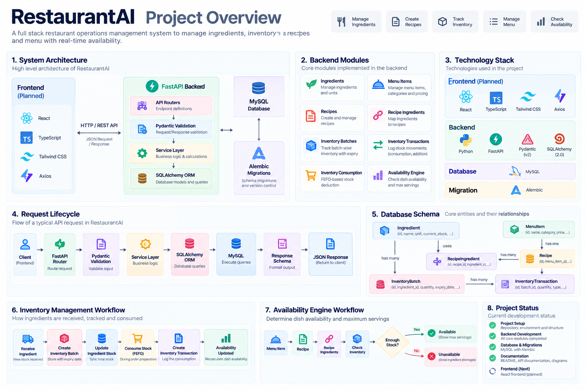
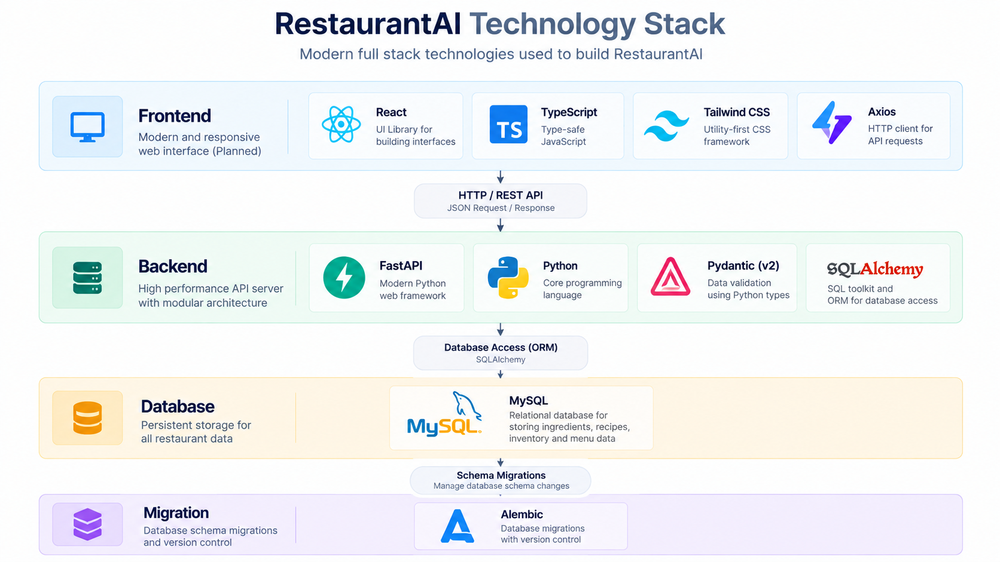
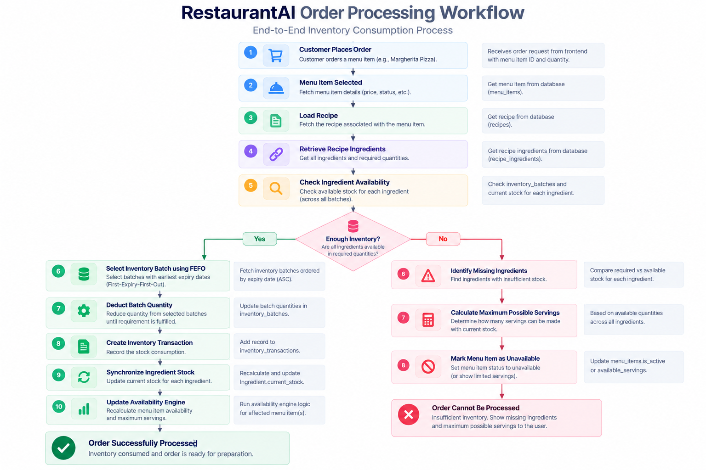
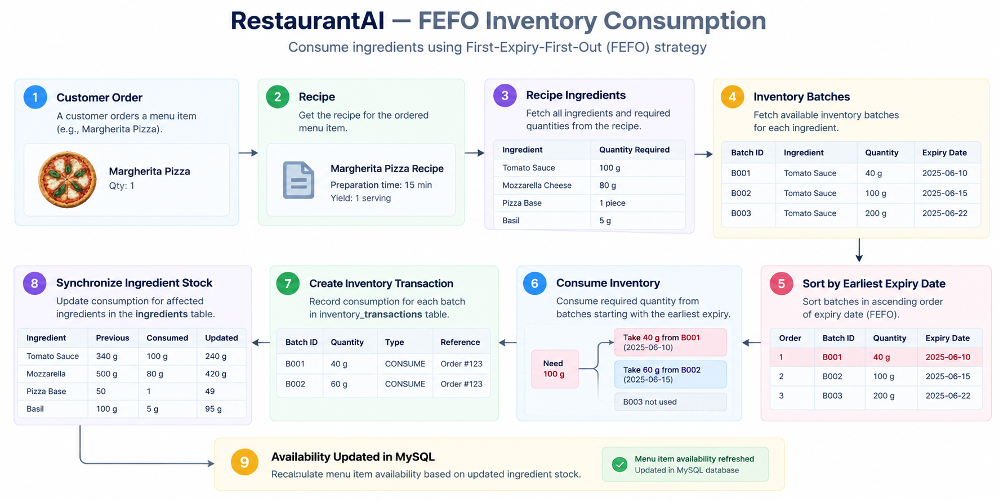
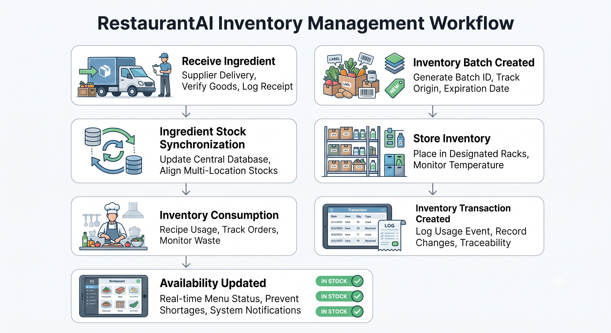
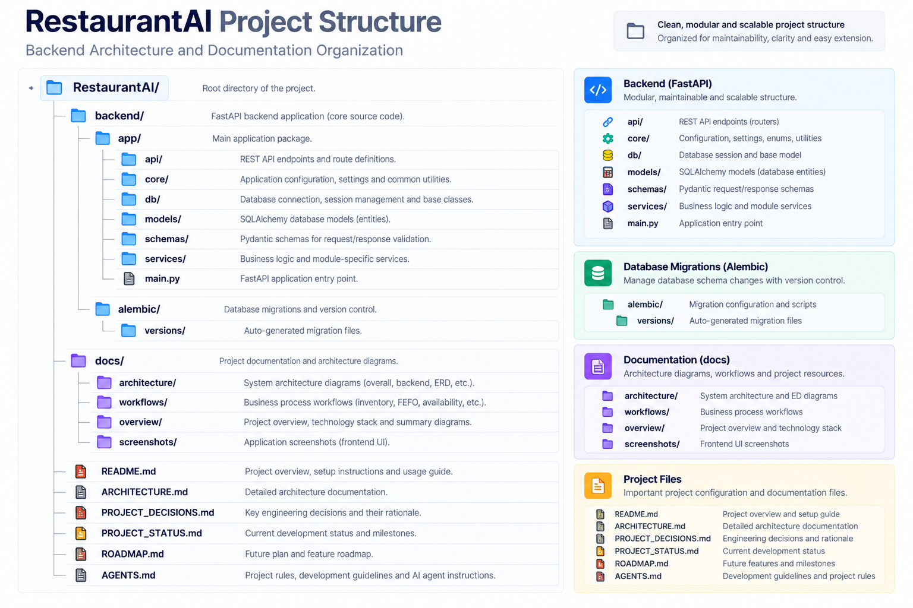

# RestaurantAI

A production-inspired **Restaurant Operations & Inventory Management System** built with **FastAPI**, **SQLAlchemy 2.0**, and **MySQL**.

[](https://www.python.org/)
[](https://fastapi.tiangolo.com)
[](https://www.sqlalchemy.org/)
[](https://www.mysql.com/)
[](https://opensource.org/licenses/MIT)
[](PROJECT_STATUS.md)

RestaurantAI is a backend system engineered to solve fundamental operational challenges in commercial restaurant kitchens: physical inventory lot tracking, immutable stock movement auditing, automated First-Expiring, First-Out (FEFO) ingredient consumption, and real-time dish availability calculation.

Built with a learning-first mindset, this project adheres to modern software engineering best practices: layered architecture, type safety, database-level integrity constraints, atomic transactions, and comprehensive automated testing.



---

## Features

- **Ingredient Master Catalog:** Standardized measurement units enforced via a core `Unit` enum (`kg`, `g`, `l`, `ml`, `pcs`), exact financial cost tracking using `Numeric(10, 2)` decimal precision, automated reorder thresholds (`minimum_stock`), and case-insensitive uniqueness validation.
- **Menu Item Commercial Catalog:** Customer-facing sales catalog with standardized `MenuCategory` enums, decoupled from kitchen recipes to allow retail items to exist without culinary formulas.
- **Culinary Recipes & Bill-of-Materials:** Strict 1-to-1 association linking commercial menu items with kitchen formulas, and an explicit many-to-many relationship (`RecipeIngredient`) defining exact ingredient quantities per serving with foreign key cascading and composite uniqueness constraints.
- **Inventory Lot Tracking & Auditing:** Physical inventory intake management tracking suppliers, intake dates, unit costs, and expiration dates with deterministic batch codes (`<CODE>-<YYYYMMDD>-<SEQ>`). Every stock movement is permanently logged via immutable transaction records (`CONSUMPTION`, `WASTE`, `ADJUSTMENT`, `EXPIRED`).
- **Synchronized Ingredient Stock:** Master ingredient stock is a single-source-of-truth derived sum of all active batches, synchronized automatically via database-level SQL `COALESCE(SUM())` aggregation. Proactive health endpoints monitor low-stock items, near-expiry lots, and expired stock.
- **Automated FEFO / FIFO Inventory Consumption:** Multi-batch ingredient deduction engine prioritizing lots closest to expiration (*First-Expiring, First-Out*) with FIFO tie-breaking. Two-phase execution validates stock across all recipe ingredients upfront and aborts atomically with zero partial writes if any item is short.
- **Real-Time Dish Availability Engine:** Instant calculations determining how many servings of any recipe or menu item can be prepared based on current stock, highlighting exact ingredient bottlenecks and shortage quantities with optimized bulk queries that eliminate N+1 database round-trips.

---

## Technology Stack



### Backend
- **Python 3.10+** — Modern type-annotated language foundation.
- **FastAPI** — High-performance ASGI REST web framework with automatic OpenAPI documentation.
- **SQLAlchemy 2.0** — Modern Python ORM utilizing explicit typed mappings (`Mapped`, `mapped_column`) and SQL expression queries.
- **MySQL 8.0** — Relational database storage providing ACID transactions, foreign key constraints, and row-level locking.
- **Alembic** — Version-controlled database schema migration pipeline.
- **Pydantic v2** — High-speed Rust-powered data validation, request parsing, and response serialization.
- **Uvicorn** — Production-grade ASGI web server.

### Testing & Tooling
- **Pytest** — Automated unit and integration testing suite.
- **PyMySQL** — Pure Python MySQL client driver.
- **Git & GitHub** — Version control and repository management.

### Frontend (Planned)
- **React 18** + **TypeScript** — Single-page application interface.
- **Tailwind CSS** — Utility-first styling for operations dashboards.
- **Axios** — Typed REST API integration client.

---

## Overall System Architecture


The application follows an end-to-end client-server architecture:
- **Client Layer:** Web applications (React frontend, interactive Swagger UI `/docs`, ReDoc) communicate with the backend exclusively through HTTP/JSON REST endpoints.
- **API Gateway & Routing Layer:** FastAPI receives requests, performs dependency injection (database sessions via `get_db`), and validates payloads against Pydantic schemas.
- **Business Domain Layer:** Domain services execute business rules, orchestrate multi-step transactions, and coordinate inventory calculations.
- **Data Persistence Layer:** SQLAlchemy 2.0 manages database connections, ORM entity states, and transaction lifecycles against MySQL 8.0.

---

## Backend Architecture


The backend is organized into a strict **Three-Tier Layered Architecture** with unidirectional dependencies:

1. **Presentation Layer (`backend/app/api/`):** Thin controllers responsible for HTTP routing, query/path parameter extraction, status codes, and delegating calls to service classes. Routers perform zero raw database queries and zero business calculations.
2. **Domain Service Layer (`backend/app/services/`):** Encapsulates domain logic, validation of business rules, multi-table transactions, stock synchronization, and availability calculations.
3. **Data Access & Persistence Layer (`backend/app/models/`, `backend/app/db/`):** SQLAlchemy 2.0 models defining table schemas, foreign keys, indexes, connection pooling (`pool_pre_ping=True`), and Alembic migrations.
4. **Cross-Cutting Concerns (`backend/app/schemas/`, `backend/app/core/`):** Pydantic v2 request/response DTOs, application configuration from `.env`, and domain enums (`Unit`, `MenuCategory`, `TransactionType`).

---

## Backend Module Dependency


The system is decomposed into cohesive domain modules with explicit, acyclic dependencies:
- **Foundation Modules:** `Ingredient` and `MenuItem` operate as independent root master catalogs.
- **Recipe Formulation:** `Recipe` links 1-to-1 with `MenuItem`. `RecipeIngredient` acts as a many-to-many bridge linking `Recipe` to `Ingredient` with required per-serving quantities.
- **Inventory Lot Tracking:** `InventoryBatch` tracks physical stock per `Ingredient`. `InventoryTransaction` records immutable audit records linked to specific batches.
- **Operational Engines:** 
  - `InventoryConsumptionService` depends on `Recipe`, `RecipeIngredient`, `InventoryBatch`, and `InventoryTransaction` to execute FEFO deductions.
  - `AvailabilityService` depends on `Recipe`, `RecipeIngredient`, and `Ingredient` to calculate live portion availability and identify bottleneck shortages.

---

## Database Design


The database schema is fully normalized and enforces data integrity directly at the relational layer:
- **`ingredients`:** Master catalog storing ingredient metadata, measurement unit enum, decimal purchase cost, minimum reorder thresholds, and the derived `current_stock`.
- **`menu_items`:** Commercial sales catalog storing customer-facing dish names, menu categories, and selling prices.
- **`recipes`:** Kitchen prep formulas linked 1-to-1 to `menu_items` with cascading deletions (`ON DELETE CASCADE`).
- **`recipe_ingredients`:** Bill of materials table joining `recipes` and `ingredients` with a composite unique constraint `(recipe_id, ingredient_id)` preventing duplicate assignments.
- **`inventory_batches`:** Physical shipments received from suppliers with deterministic batch codes, remaining quantities, intake dates, and expiration dates.
- **`inventory_transactions`:** Append-only audit ledger recording stock deductions (`CONSUMPTION`, `WASTE`, `ADJUSTMENT`, `EXPIRED`) with strict positive quantity constraints (`quantity > 0`).

---

## Request Lifecycle


Every client request executes through a deterministic 6-step lifecycle:
1. **HTTP Request:** The client dispatches a JSON HTTP request to a specific REST endpoint.
2. **FastAPI Routing & Dependency Injection:** The router matches the path, extracts parameters, and resolves dependencies, providing an isolated database session via `get_db()`.
3. **Pydantic Schema Validation:** The request body is validated against Pydantic DTOs. If field types or constraints fail, an immediate `422 Unprocessable Entity` is returned without touching the database.
4. **Service Execution & Business Rules:** The domain service validates operational conditions (entity existence, stock sufficiency, duplicate name checks) and raises semantic HTTP exceptions (`400`, `404`, `409`) when rules are violated.
5. **Database Transaction:** SQLAlchemy stages SQL statements, commits the transaction, and executes database-level aggregations. On failure, changes are rolled back automatically.
6. **Response Serialization:** Output ORM entities are serialized into response schemas (`from_attributes=True`) and returned with the appropriate HTTP status code (`200 OK`, `201 Created`).

---

## Order Processing Workflow



When an order is submitted to the kitchen:
1. **Availability Verification:** The system verifies that the requested menu item has an active recipe and checks real-time portion availability.
2. **Two-Phase Pre-Validation:** The consumption engine inspects all required ingredients across all active batches. If any single ingredient is short, the request is rejected with a `400 Bad Request` and zero partial changes are persisted.
3. **Automated FEFO Allocation:** Stock is drawn from batches ordered by expiration date (earliest first), splitting deductions across multiple lots as needed.
4. **Audit Logging & Balance Synchronization:** An immutable `CONSUMPTION` transaction is recorded for each depleted batch, and master ingredient stock balances are updated atomically within the same transaction.
5. **Order Confirmation:** The order is confirmed with updated inventory levels and order fulfillment details.

---

## FEFO Inventory Consumption



The **First-Expiring, First-Out (FEFO)** consumption engine minimizes food waste by ensuring perishable ingredients nearing expiration are consumed first:
- **Priority 1 (FEFO):** Batches are sorted by `expiry_date ASC`.
- **Priority 2 (FIFO Tie-Breaker):** Batches with identical expiration dates are sorted by `received_date ASC`.
- **Priority 3 (Deterministic Resolution):** Remaining ties are broken by `batch_number ASC`.
- **Multi-Batch Spanning:** If the primary batch has insufficient stock, it is depleted to `0.00` and the remaining required quantity is automatically drawn from the next eligible batch.
- **Atomicity:** The entire multi-ingredient, multi-batch deduction runs inside a single database transaction. If any error occurs, all batch changes and transaction logs roll back.

---

## Inventory Management



The inventory module provides end-to-end lifecycle tracking for physical stock:
- **Batch Intake:** New shipments are received via `POST /inventory-batches/` with supplier information, unit costs, and expiration dates. A deterministic batch number is generated: `<CODE>-<YYYYMMDD>-<SEQ>`.
- **Stock Synchronization:** The master `Ingredient.current_stock` is a derived value synchronized using optimized database-level SQL `COALESCE(SUM())` queries. Manual stock overwrites are prevented.
- **Immutable Movement Auditing:** All deductions (kitchen prep, waste, spoilage, shrinkage) must be recorded through `InventoryTransaction`. Transaction records cannot be edited or deleted via the API.
- **Proactive Health Monitoring:**
  - `GET /inventory-batches/low-stock`: Flags ingredients at or below reorder points (`current_stock <= minimum_stock`).
  - `GET /inventory-batches/expiring`: Surfaces active batches expiring within a configurable window (default 7 days).
  - `GET /inventory-batches/expired`: Identifies expired batches with remaining stock for disposal write-offs.

---

## Availability Engine


The Availability Engine answers: *"How many servings of this dish can the kitchen prepare right now?"*

$$\text{Servings Available} = \min_{i \in \text{Ingredients}} \left\lfloor \frac{\text{Ingredient.current\_stock}_i}{\text{RecipeIngredient.quantity}_i} \right\rfloor$$

- **Bottleneck Detection:** Identifies the precise limiting ingredient constraining production and computes the exact shortage quantity required for additional servings.
- **Strictly Read-Only:** Executes without write locks or database modifications, ensuring zero interference with concurrent inventory transactions.
- **N+1 Query Optimization:** Bulk endpoints (`/availability/recipes` and `/availability/menu-items`) execute batch lookups using SQL `IN` operators and eager relationship joins (`joinedload`), reducing hundreds of individual database round-trips to just 2 or 3 queries.

---

## Project Structure



```text
restaurant-ai/
├── backend/
│   ├── alembic/                # Database migration scripts
│   │   ├── versions/           # Version-controlled schema migrations
│   │   └── env.py              # Alembic environment and model metadata
│   ├── alembic.ini             # Alembic configuration
│   └── app/
│       ├── api/                # Presentation Layer (FastAPI Routers)
│       │   ├── availability.py
│       │   ├── health.py
│       │   ├── ingredients.py
│       │   ├── inventory.py
│       │   ├── inventory_batches.py
│       │   ├── inventory_transactions.py
│       │   ├── menu_items.py
│       │   ├── recipes.py
│       │   └── recipe_ingredients.py
│       ├── core/               # Cross-cutting concerns (Settings & Enums)
│       │   ├── config.py       # Pydantic Settings loaded from .env
│       │   └── enums.py        # Domain Enums (Unit, MenuCategory, TransactionType)
│       ├── db/                 # Database engine & session lifecycle
│       │   └── database.py     # Connection pool & get_db dependency
│       ├── models/             # SQLAlchemy 2.0 declarative database entities
│       │   ├── ingredient.py
│       │   ├── inventory_batch.py
│       │   ├── inventory_transaction.py
│       │   ├── menu_item.py
│       │   ├── recipe.py
│       │   └── recipe_ingredient.py
│       ├── schemas/            # Pydantic v2 request/response DTO schemas
│       │   ├── availability.py
│       │   ├── ingredient.py
│       │   ├── inventory_batch.py
│       │   ├── inventory_consumption.py
│       │   ├── inventory_transaction.py
│       │   ├── menu_item.py
│       │   ├── recipe.py
│       │   └── recipe_ingredient.py
│       ├── services/           # Domain business logic & transactional coordination
│       │   ├── availability_service.py
│       │   ├── ingredient_service.py
│       │   ├── inventory_batch_service.py
│       │   ├── inventory_consumption_service.py
│       │   ├── inventory_transaction_service.py
│       │   ├── menu_item_service.py
│       │   ├── recipe_service.py
│       │   └── recipe_ingredient_service.py
│       └── main.py             # FastAPI entrypoint & router assembly
├── docs/                       # Architecture diagrams & visual documentation
│   ├── availability-engine-workflow.png
│   ├── backend-architecture.png
│   ├── backend-module-dependency.png
│   ├── database-erd.png
│   ├── fefo-consumption-workflow.png
│   ├── inventory-management-workflow.png
│   ├── order-processing-workflow.png
│   ├── overall-system-architecture.png
│   ├── project-folder-structure.png
│   ├── project-overview.png
│   ├── request-lifecycle.png
│   └── technology-stack.png
├── tests/                      # Automated test suite
│   └── test_availability.py
├── .env.example                # Sample environment variables
├── ARCHITECTURE.md             # In-depth system architecture documentation
├── PROJECT_DECISIONS.md        # Technical decisions & engineering rationale
├── PROJECT_STATUS.md           # Implementation status & completed capabilities
├── ROADMAP.md                  # Development roadmap & milestones
├── requirements.txt            # Python dependencies
└── README.md
```

---

## Documentation

- [ARCHITECTURE.md](ARCHITECTURE.md) — Comprehensive technical architecture, system layers, and request lifecycle.
- [PROJECT_DECISIONS.md](PROJECT_DECISIONS.md) — Technical decision log, alternatives evaluated, trade-offs, and interview key takeaways.
- [PROJECT_STATUS.md](PROJECT_STATUS.md) — Current implementation milestones, test coverage, and capabilities.
- [ROADMAP.md](ROADMAP.md) — Project development phases from completed backend modules to frontend and production deployment.
